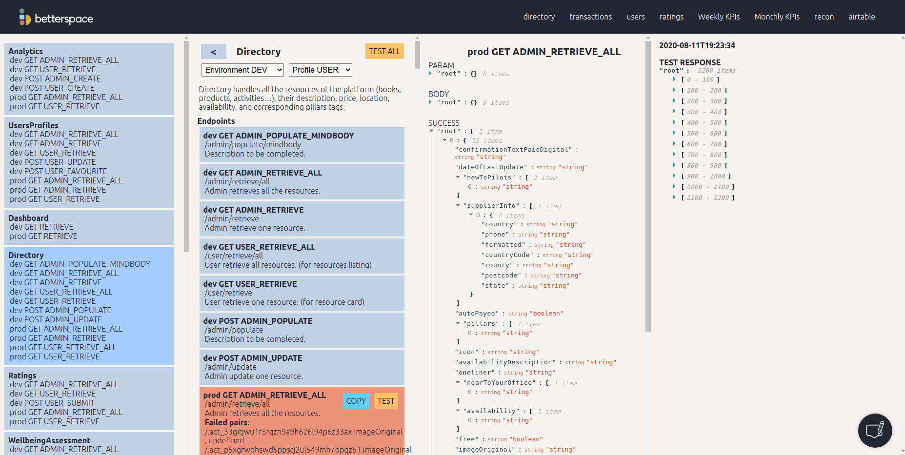

# testApi

This is a presentation of a tool I created for the purpose of testing every internal API.

## The problem

The company needs to find errors quickly before it goes live, without tests, the errors are found randomly, hopefully by devs, sometimes by admins and unfortunately by users.

## The stakeholders

The stakeholders involve in this process are mainly the Backend Developer and the CTO.

## The requirements - User stories

As a Backend Developer:

- So I can find and identify errors in the Backend code or in the database, I need to:

  - Be able to test every API with different users and calls

## Screenshots

Below you can see the testing tool:

- 1st column - the user selects the Microservice.

- 2nd column - the user selects the specific call (environment and user were done manually, it was not yet implemented)

- 3rd column - the user would see the details related to the test of the specific call (param, body, success), the user could also modify the test directly in order to refine the focus of the test.

- 4th column - the user would see the result of the call

From those columns, once the user had clicked on 'TEST' it could see:

- if the call was successfull or not
- if the type of every value of the object returned was correct, if not, the user could find the list of errors (in the red box on the screenshot). Every error message helps to find it in the database and in the object.

